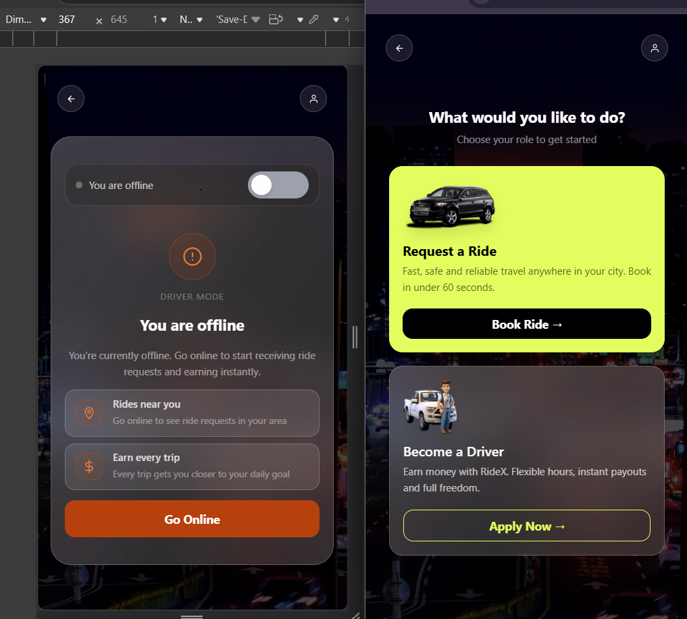
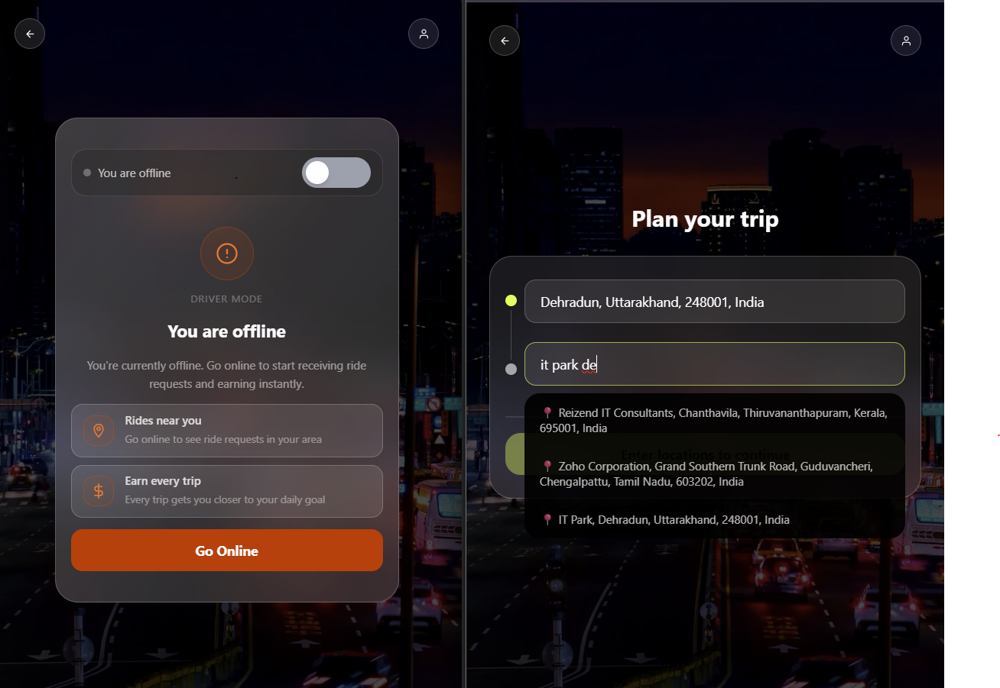
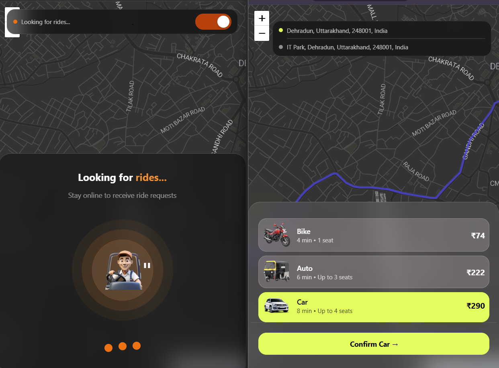
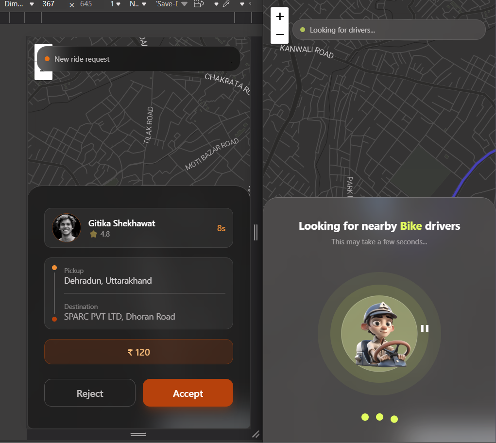
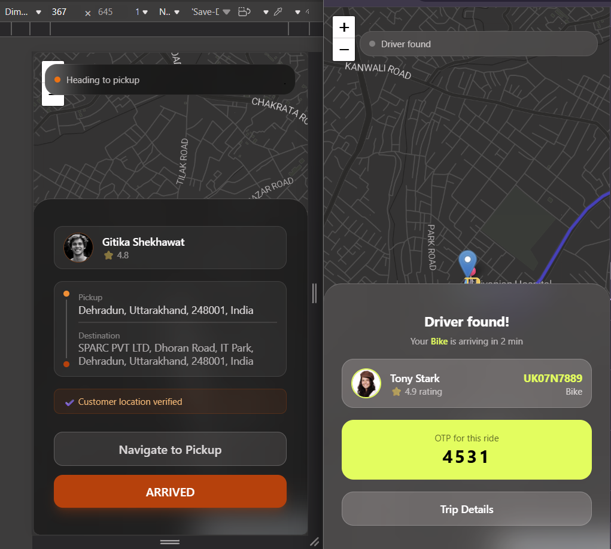
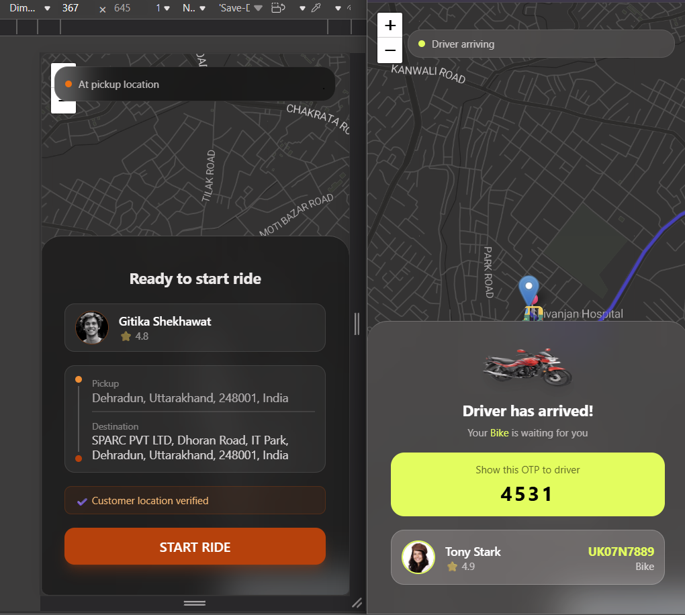
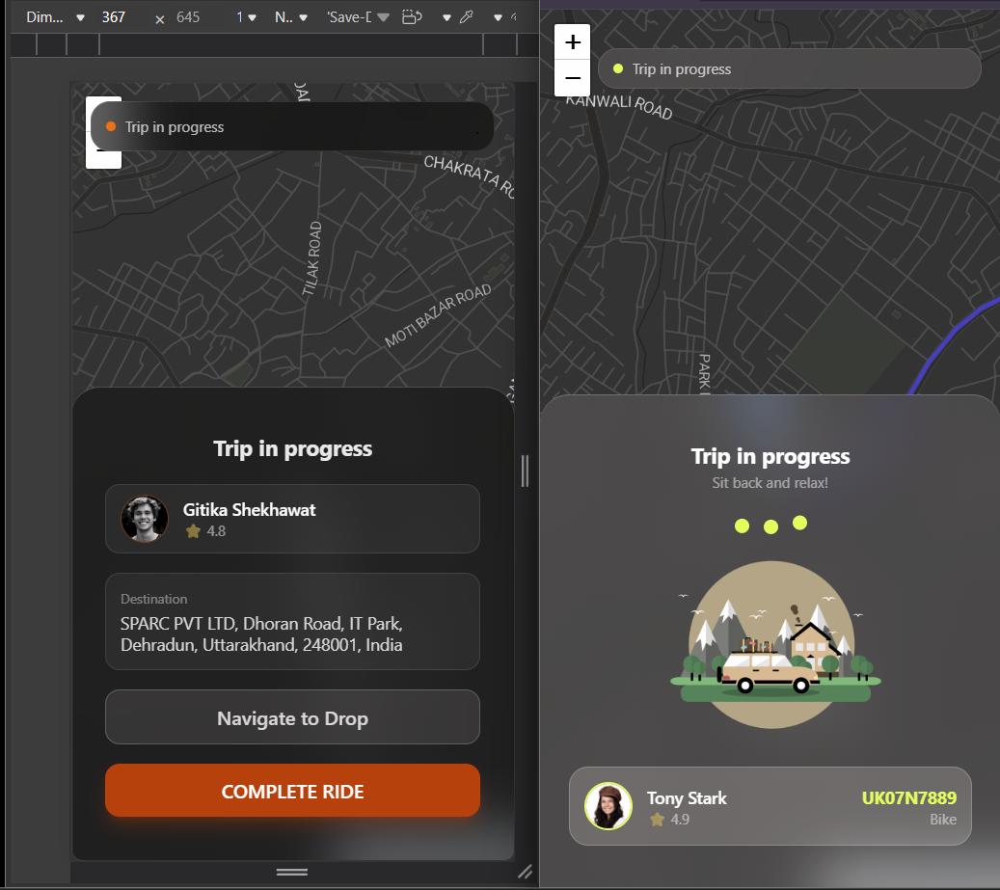

#  RideX - Real-Time Ride Sharing Application

A full-stack real-time ride-hailing platform built using the MERN stack with Socket.io. The application supports real-time ride requests, driver dispatching, live tracking, and secure authentication.

---

##  Highlights

* Real-time ride dispatch system
* Geospatial driver matching using MongoDB
* Scalable backend architecture with Socket.io
* Complete ride lifecycle management

---

##  Tech Stack

* **Frontend:** React.js, Tailwind CSS, Leaflet.js
* **Backend:** Node.js, Express.js
* **Database:** MongoDB (Geospatial Queries)
* **Real-Time:** Socket.io
* **Authentication:** JWT (JSON Web Tokens)
* **APIs:** OSRM (Routing), Nominatim (Geocoding)

---

##  Key Features

*  Real-time ride request handling using Socket.io
*  Driver dispatch system using MongoDB `$near` queries
*  Sequential ride allocation with timeout and auto-forwarding
*  JWT-based authentication with role-based access control (RBAC)
*  Live driver tracking and route rendering using Leaflet.js and OSRM
*  Address autocomplete and reverse geocoding using Nominatim API
*  Ride lifecycle state machine:
  `REQUESTED → ASSIGNED → ARRIVED → STARTED → COMPLETED → CANCELLED`

---
## 📸 Screenshots

### 1. Home Screen



### 2. Destination Selection



### 3. Ride Selection



### 4. Ride Request



### 5. Driver Accepted Request



### 6. Driver Arrived



### 7. Trip Started



---

## ⚙️ Installation & Setup

```bash
# Clone the repository
git clone https://github.com/gitika-shekhawat15/ride-booking-system.git

# Backend setup
cd backend
npm install
npx nodemon

# Frontend setup
cd frontend
npm install
npm run dev
```

---

## 🔐 Environment Variables

Create a `.env` file inside the backend and frontend folder:
# Backend (Vite)


PORT=4000
MONGO_URI=your_mongodb_connection
JWT_SECRET=your_secret_key
JWT_EXPIRES_IN=7d

# Frontend (Vite)
VITE_API_URL=http://localhost:4000
```

---

##  What I Learned

* Building real-time systems using Socket.io
* Designing scalable backend architecture
* Implementing geospatial queries in MongoDB
* Managing ride lifecycle using state machines
* Handling edge cases in real-time ride dispatch

---

##  Future Improvements

* Payment integration
* Ride history dashboard
* Push notifications
* Performance optimization for large-scale users

---
## 🔗 GitHub Repository

[View Project on GitHub](https://github.com/gitika-shekhawat15/ride-booking-system)

##  Contact

* **GitHub:** https://github.com/gitika-shekhawat15
* **LinkedIn:** https://www.linkedin.com/in/gitika-shekhawat1507/

---
